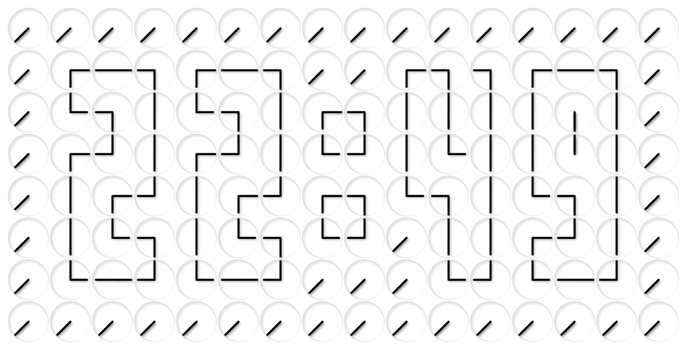

# A Million Times Clock – Digital Wall Clock Art

A fullscreen digital clock artwork inspired by [ClockClock](https://www.humanssince1982.com/).
Choose themes, adjust transitions, and display the time beautifully on any screen.

**Features**
- Responsive grid of mini-clocks forming the current time
- Theme selector (light, dark, navy, forest, gold)
- Smooth transitions and fullscreen mode

See the result on [www.a-million-times.com](https://www.a-million-times.com/)

> 🖥️ **Windows Screensaver**
>
> Prefer this artwork as a Windows screensaver?  
> https://github.com/techniccontroller/a-million-times-screensaver
